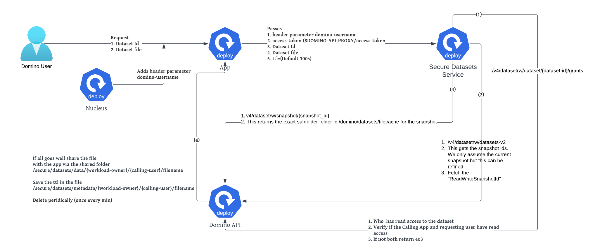

# Service to Access Datasets Securely From an App

This is an implementation of a custom service which can be invoked from a Domino App. It provides an object
store view to Datasets.

## Personas

To understand how this service works we establish two main personas from the perspective of the service

| Persona Name        | Identification Mechanism                                                                         |
|---------------------|--------------------------------------------------------------------------------------------------|
| App/Workspace Owner | Pass the token returned by `$DOMINO_API_PROXY/access-token` from the app or workspace            |
| App Caller          | This is the plain text `domino-username`. App receive as request header parameter with this name |

## Concepts and Terminology

| Concept                | Description                                                                                                                          |
|------------------------|--------------------------------------------------------------------------------------------------------------------------------------|
| Domino Service Account | This will be the App owner. Apps can only be started using a Service Account                                                         |
| App Admission Webhook  | A K8s Admission Webhook which will prevent and App pod from being started unless the starting user is explicitly permitted           |
| Environment            | One of [dev/test/prod]. A Domino Service Account permitted to start an app will be assigned to **exactly** one of these environments |
| Dataset Id             | The id of the dataset as returned by one of the Domino endpoint `/v4/datasetrw/datasets-v2`|  
| Object Key             | The fully qualified path of the file being requested for a specific `dataset-id`|


## Service Endpoints


| Endpoint                                  | Description                                                                                                                                  |
|-------------------------------------------|----------------------------------------------------------------------------------------------------------------------------------------------|
| /dataset/all                              | This is a convinence wrapper around the Domino Endpoint `/v4/datasetrw/datasets-v2`                                                          |
| /dataset/canread/<dataset_id>/<domino_username> | Does the `domino_username` have access to the `dataset_id`                                                                                   |
| /dataset/list/<dataset_id>                | Return a listing of the folder for a specific domino `dataset_id`                                                                            |
| /dataset/fetch/<dataset_id>         | Return a the requested object (file) for a dataset in `dataset_id` in the folder `/secure/datasets/data/{workload-owner}/{calling-username}` |  


Example output for `/dataset/canread/<dataset_id>/<domino_username> |`

```json
{
    "app_owner": {
        "can_read": true,
        "username": "user-ds-1"
    },
    "calling_user": {
        "can_read": true,
        "username": "user-ds-2"
    },
    "dataset_id": "662fbf1c4d68ee2895b43742"
}
```


### Mounts in the Service Endpoint 
The last endpoints need a more detailed discussion. The service does not actually stream out the file. Instead, the following
mounts are added to the secure datasets service to share the files with the App

```text
/secure/datasets/data
/secure/datasets/data
/secure/datasets/data
/secure/datasets/data
```


The following is also mounted in the service `/domino/datasets/filecache`. This is the path in the NFS (EFS for AWS) where
Domino maintains all the dataset snapshots by `snapshot-id`

All above mounts are backed by the PVC `domino-shared-store-domino-compute-vol` which in turn is backed by the storage
class `dominoshared`. 

### Process in the endpoint `/dataset/fetch/<dataset_id>`

When the endpoint `/dataset/fetch/<dataset_id>` is invoked the following steps take place

1. The endpoint has two args:
   - `path` - This is the fully qualified path of the file being requested
   - `ttl` - This is an optional parameter. Default is `300`(s)
2. The endpoint identifies of the caller of the endpoint based on either a bearer token in the request header parameter 
   `Authorization` or the DOMINO API KEY in the request header parameter `X-Domino-Api-Key`
3. The endpoint extracts the App caller from the header parameter `domino-username`
4. The endpoint then makes a call to the Domino endpoint `/v4/datasetrw/dataset/{dataset-id}/grants` using the App Owner token 
   to verify if both, the app-owner and the app-caller, have access to the dataset being requested
5. If the (4) is true for both principals, the service gets the `ReadWriteSnapshotId` of the `dataset-id`. In fact 
   the solution can be extended to any `snapshotId`. It does this by invoking the endpoint `v4/datasetrw/datasets-v2`
   using the App-Owner token.
6. Lastly we need the exact folder which contains the files in the snapshot. This information is obtained by calling
   the endpoint `v4/datasetrw/snapshot/{snapshot_id}` using the App Owner token. We will refer to this as `{sub-folder-for-snapshot-id}`
7. Now the service reads the file directly using the path `/domino/datasets/fileshare/{sub-folder-for-snapshot-id}`
8. The random file name (`{rnd_file_name}`) is generated and the file `/domino/datasets/fileshare/{sub-folder-for-snapshot-id}/{path}` is copied
   to the folder `/secure/datasets/data/{workload-owner}/{calling-user}/{rnd_file_name}`
9. Another file is added to the folder `/secure/datasets/metadata/{workload-owner}/{calling-user}/{rnd_file_name}.json` which stores
   - `source_file` ==  `/domino/datasets/fileshare/{sub-folder-for-snapshot-id}/{path}`
   - `target_file` ==  `/secure/datasets/data/{workload-owner}/{calling-user}/{rnd_file_name}`
   - `ttl` == (Default 300s or user speciified in the request)
10. The service monitors the folder `/secure/datasets/metadata/` every minute for expired files and removes them
     from the `/secure/datasets/data/` folder. The App has no control over it.

11. The process is out}lined in the 


### Service Endpoints

The following endpoints are exposed by the service. Each of these endpoints need to be invoked by 
passing an Authentication bearer token obtained from `$DOMINO_API_PROXY/access-token` or `DOMINO_API_KEY` in the header
parameter `X-Domino-Api-Key`. This principal is known as the "Workload Owner"

| Endpoint     | Description                                                                                                | 
|--------------|------------------------------------------------------------------------------------------------------------|
| /dataset/all | This is a convinience wrapper around `v4/datasetrw/datasets-v2`. The app could just call the main endpoint |
| /dataset/canread/<dataset_id>   | Status code 200 means both the caller identified by the bearer token and `domino_username` has access to the dataset id |
| /dataset/list/<dataset_id>   | If permitted, list of folder contents. If not status code 403 is returned                                  |
| /dataset/fetch/<env>/<dataset_id>   | For a path defined as a argument, returns the dataset file if permitted to access dataset           |


### Service Parameters

For each of the endpoints below, the access token recognizes the `workload-owner` and the request header contains
a parameter `domino-username` which identifies the `calling-username`

| Endpoint     | Parameters                                                    | 
|--------------|---------------------------------------------------------------|
| /dataset/all | None                                                          |
| /dataset/canread/<dataset_id> | None                                                          |
| /dataset/list/<dataset_id>   | `path` the folder for which listing is desired                |
| /dataset/fetch/<dataset_id>   | `path` full path of the file, `ttl` time to live for the file |


## Scenarios

In this section we will run through scenarios. 

### Named Users
Let us assume the following named users 


| User               | Role          | Is Power User for Secure Datasets Service | 
|--------------------|---------------|-------------------------------------------|
| `integration-test` | Administrator | Yes                                       |
| `user-ds-1`        | Practitioner  | No                                        |
| `user-ds-2`        | Practitioner  | No                                        |
| `user-ds-3`        | Practitioner  | No                                        |
| `dev-app-1-owner`  | Practitioner  | No                                        |
| `test-app-1-owner` | Practitioner  | No                                        |
| `prod-app-1-owner` | Practitioner  | No                                        |

The power user will have a designated project (via the helm install) where the following
folders are mounted
```text
/secure/datasets/data
/secure/datasets/metadata
```
The purpose is to allow a power user to debug situations. Note that a Domino
Administrator as full access to all Datasets. This does not violate any existing 
access control contract in Domino. This is a powerful super-user feature and 
recommend using it very cautiously

### Domino Service Accounts

Next we assume the following Domino Service Accounts 

| User              | Role | 
|-------------------|------|
| `svc-user-ds-1`   | Dev  |
| `svc-user-ds-2`   | Dev  |
| `svc-user-ds-3`   | Dev  |
| `svc-test-app-1	` | Test |
| `svc-prod-app-1	` | Prod |

| User             | Token owned by user | 
|------------------|---------------------|
| `svc-ds-user-1`  | `user-ds-1`         |
| `svc-ds-user-2`  | `user-ds-2`         |
| `svc-ds-user-3`  | `user-ds-3`         |
| `svc-test-app-1` | `user-ds-2`         |
| `svc-prod-app-1` | `integration-test`  |

Note that we have user  `user-ds-2`  has roles of a developer and tester
`integration-test` has roles of `production` user.

One user can assume multiple roles. But a service account can belong to zero or one
environment (from an App perspective). This decides which folder is mounted for the App
to share dataset objects with the Secure Datasets Service. 

### Domino Datasets

| Dataset          | Owner              | Writer             | Reader                                                    | 
|------------------|--------------------|--------------------|-----------------------------------------------------------|
| `dataset-1`      | `user-ds-1`        | `user-ds-1`        | `user-ds-1`,`user-ds-2`,`user-ds-3`                       |
| `dataset-2`      | `user-ds-2`        | `user-ds-2`        | `user-ds-2`,`user-ds-3`                                   |
| `dataset-3`      | `user-ds-3`        | `user-ds-3`        | `user-ds-3`                                               |
| `dev-dataset-1`  | `dev-app-1-owner`  | `dev-app-1-owner`  | `svc-user-ds-[1,2,3]`,`user-ds-1`,`user-ds-2`,`user-ds-3` |
| `dev-dataset-2`  | `dev-app-1-owner`  | `dev-app-1-owner`  | `svc-user-ds-[1,2,3]`,`user-ds-2`,`user-ds-3`             |
| `dev-dataset-3`  | `dev-app-1-owner`  | `dev-app-1-owner`  | `svc-user-ds-[1,2,3]`,`user-ds-3`                         |
| `test-dataset-1` | `test-app-1-owner` | `test-app-1-owner` | `svc-test-app-1`,`user-ds-1`,`user-ds-2`,`user-ds-3`      |
| `test-dataset-2` | `test-app-1-owner` | `test-app-1-owner` | `svc-test-app-1`,`user-ds-2`,`user-ds-3`                  |
| `test-dataset-3` | `test-app-1-owner` | `test-app-1-owner` | `svc-test-app-1`,`user-ds-3`                              |
| `prod-dataset-1` | `prod-app-1-owner` | `prod-app-1-owner` | `svc-prod-app-1`,`user-ds-1`,`user-ds-2`,`user-ds-3`      |
| `prod-dataset-2` | `prod-app-1-owner` | `prod-app-1-owner` | `svc-prod-app-1`,`user-ds-2`,`user-ds-3`                   |
| `prod-dataset-3` | `prod-app-1-owner` | `prod-app-1-owner` | `svc-prod-app-1`,`user-ds-3`                               |

The above should make it clear how adding data to datasets and having read access to datasets is 
clearly separated. Named Domino users have permissions to write to the datasets they own.

Service Account users can have read access to specific datasets and other named users can also 
have read access.

Also note how the development dataset are recommended to be separate from production datasets. This enforces a conscious 
decision making  process regarding allowing access control to datasets via apps . This is not required but having this 
level of governance ensures that the integrity of your data access protocols is ensured.


### How a workload mount looks like depending on Workload Type and Starting User

#### Workspaces 

| Workload Owner | Mount                                                   | 
|----------------|---------------------------------------------------------|
| `integration-test` | /secure/datasets/data/integration-test/integration-test |
| `user-ds-1`        | /secure/datasets/data/user-ds-1/user-ds-1               |
| `user-ds-2`        | /secure/datasets/data/user-ds-2/user-ds-2               |
| `user-ds-3`        | /secure/datasets/data/user-ds-3/user-ds-3               |
| `dev-app-1-owner`  | /secure/datasets/data/dev-app-1-owner/dev-app-1-owner   |
| `test-app-1-owner` | /secure/datasets/data/test-app-1-owner/test-app-1-owner |
| `prod-app-1-owner` | /secure/datasets/data/prod-app-1-owner/prod-app-1-owner                 |

From inside a workspace anyone can invoke the `secure-datasets-svc` but they can only
request a dataset object for themselves. If they invoke it for any other user even if the 
workspace owner has access to the dataset, it won't be visible to the caller because the
user folder for the "calling-username" that is mounted is identical to the "workload-owner"


#### App 

An App has the following mounts
`/secure/datasets/data/{workload-owner}`
`/secure/datasets/metadata/{workload-owner}`

| Workload Owner     | Mount                                                                                 | 
|--------------------|---------------------------------------------------------------------------------------|
| `svc-ds-user-1`    | `/secure/datasets/data/svc-ds-user-1` <br/> `/secure/datasets/metadata/svc-ds-user-1` |
| `svc-ds-user-2`    | `/secure/datasets/data/svc-ds-user-2` <br/> `/secure/datasets/metadata/svc-ds-user-2` |
| `svc-ds-user-3`    | `/secure/datasets/data/svc-ds-user-3` <br/> `/secure/datasets/metadata/svc-ds-user-3` |
| `svc-test-app-1`   | `/secure/datasets/data/svc-test-app-1` <br/> `/secure/datasets/metadata/svc-test-app-1`|
| `prod-test-app-1`  | `/secure/datasets/data/prod-test-app-1` <br/> `/secure/datasets/metadata/prod-test-app-1`    |

Note that while the service accounts are owned by named users, they have access to different datasets
as compared to the named users. It is imperative that a proper process be followed to add data to
datasets accessible to service accounts.


The `secure-datasets-svc` has all the possible mounts. 

`/secure/datasets/data/`
`/secure/datasets/metadata/`

> An important aspect of this design is datasets need to be logically divided by {workload-owners}
> Consequently for a given App workload the only datasets that can be read are the ones available to the App Owner
> The Caller can only access datasets that are accessbile to both the App-Owner and the App-Caller
> The enforcement aspect of only allowing designated service accounts to deploy Apps ensures that proper process is 
> followed when providing dataset access to service accounts, code-review to ensure code is not malicious or buggy 
> causing data leaks


## Process

1. A user will develop code against raw datasets in the workspace
2. A user will deploy code to an App using a service account assigned to them
   - The user will request a test dataset to be created and allocated to them by `dev-app-1-owner`
   - It is the responsibility of the `dev-app-1-owner` to not include sensitive data in these datasets
3. Next the test user will deploy the App using a service account assigned to them
   - The user will request a test dataset to be created and allocated to them by `test-app-1-owner`
   - It is the responsibility of the `test-app-1-owner` to not include sensitive data in these datasets
3. Lastly a prod user will deploy the App using a service account assigned to them
   - The user will request a prod dataset to be created by `prod-app-1-owner`
   - It is the responsibility of the `prod-app-1-owner` to ensure that only the right users have access to these datasets

## Installation

0. Build the image by running the following command
```shell
export tag=v0.0.1
./create_image.sh $tag
```

1. First create a Service Account in Domino and note its name and the token value. Our Service Account name 
   in the demo env `secure-ds-access-sa`

2. The installation is a helm chart. See the `values.yaml` in the root folder. The only values unique to your deployment
will be:
   
    - **admin_user**: `integration-test` (Pick one Domino Administrator who can test this service from a local 
        workspace. This Admin's workspace for project with Domino Project Id mentioned in the next step 
        will have the same configuration as the chosen App started by a Service Account)
   
    - **admin_project_id**: `662a70a548ce7c5c14d8d3ce` (This is the Domino Project Id for the `quick-start`
   project owned by the `integration-test` user) 
   
    - **sa_user_name**: secure-ds-access-sa (This is the service account who will have the token
   mounted which will permit it to allow calling the secure datasets access service)
    
   Perform the helm install
   ```shell
        export compute_namespace=domino-compute
        helm install -f values.yaml secure-dataset-access-service helm/secure-dataset-access-service -n ${compute_namespace}
    ```
    The corresponding commands for helm delete and upgrade are:
    ```shell
        export compute_namespace=domino-compute
        helm delete secure-dataset-access-service -n ${compute_namespace}
    ```

   ```shell
        export compute_namespace=domino-compute
        helm upgrade secure-dataset-access-service helm/secure-dataset-access-service -n ${compute_namespace}
    ```

   Lastly patch the secret with the actual token value of the service account. I have placed
   the token in the file `./root-folder/etc/tokens/token`
    ```shell
        kubectl -n domino-compute patch secret secure-datasets-client-token --patch="{\"data\":{\"token\":\"$(base64 -i ./root-folder/etc/tokens/token)\"}}"
    ```
   
## Improvments

1. Verify the token is signed 
2. Use gunicorn to scale the secure datasets service
3. Can we use symlinks intead of copying files


## Starting an App from Code


To start the app, first start it manually and note the id of the `modelProducts` and shut down the app

```python
import requests
import json
import os

domino_api_host = os.environ["DOMINO_API_HOST"]

modelProductId='6632694cb0361c7a46730640'
token_file = "/etc/tokens/token"
sa_token = ""
with open(token_file, 'r') as file:
    # Read the entire file content into a variable
    sa_token = file.read()
url = f"{domino_api_host}/{modelProductId}/start"
      

payload = json.dumps({
  "hardwareTierId": "small-k8s",
  "environmentId": "662a613292c1117e2b322d02",
  "externalVolumeMountIds": []
})
headers = {
  'Content-Type': 'application/json',
  'Authorization': f"Bearer {sa_token}"
  }

response = requests.request("POST", url, headers=headers, data=payload)
print(response.status_code)
print(response.text)
```
To stop the App do the following:
```python
import requests
import os

domino_api_host = os.environ["DOMINO_API_HOST"]

modelProductId='6632694cb0361c7a46730640'
token_file = "/etc/tokens/token"
sa_token = ""
with open(token_file, 'r') as file:
    # Read the entire file content into a variable
    sa_token = file.read()
url = f"{domino_api_host}/{modelProductId}/stop?force=true"

headers = {
  'Content-Type': 'application/json',
  'Authorization': f"Bearer {sa_token}"
  }

response = requests.request("POST", url, headers=headers, data={})

print(response.status_code)
print(response.text)

```

The app started with any other user (including an Admin) will not have the sa tokens mounted
to access the secure-dataset access service. 

Which is why to test the functionality we designate an Domino Admin User and a Project owned by the Domino Admin

The [notebook](./notebooks/app_emulation.ipynb) is provided for this test

## Next Steps

1. Add audit capabilities
   - Datetime
   - Dataset Id
   - Snapshot Id
   - Orginal Source filepath
   - Target Temporary filepath
   - Ttl
   - Workload Owner
   - Workload Caller
2. Support reading of any snapshots
3. Remove dataset mounts
4. Horizontal Scaling of Secure Datasets Service


